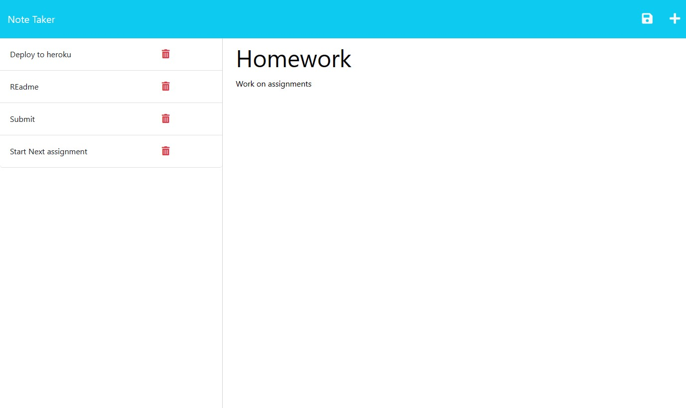

# Note Taker

## Description 

This application is used to write and save notes so that the user can organize their thoughts and keep track of tasks they need to complete. Using express.js, the front and back end are linked so that the application can use a custom database to save notes and middleware to deal with http requests

## Table of Contents

- [Usage](#usage)
- [License](#license)
- [questions](#questions)

## Usage

1. From the Note Taker home page, click "Get Started" to view saved notes and to create new notes.
2. You can click the saved notes listed on the left to view more details. 
3. The note title and text will appear on the right side of the page. 
4. To create a new note at anytime, press the + icon on the top right. 
5. When both title and text sections have text within them, the save icon will appear beside the +. 
6. To delete any saved notes, simply press the garbage bin icon beside them.

## License

Please refer to the LICENSE in the repo

## Questions

Check out my GitHub here: https://github.com/jjocelynn